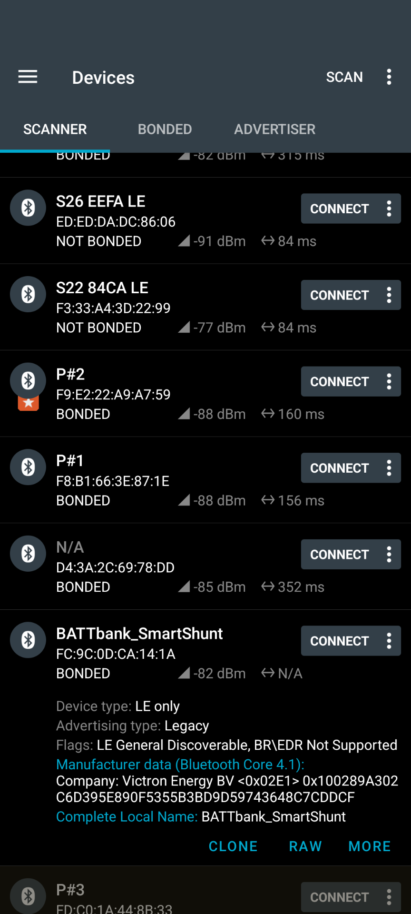

## Read Victron Advertised Data
This submission provides two Arduino compatible programs (one for a Victron battery monitor the other a Victron solar controller). These programs bring together all the following knowledge to receive, dissect, decrypt, decode and report the current device status and readings from the 'advertised data' that is continually transmitted over Bluetooth Low Energy (BLE) by the Victron device

### My Hardware
My battery monitors are a [Victron Smartshunt](https://www.victronenergy.com/battery-monitors/smart-battery-shunt) and several [Victron BMV-712 Smart](https://www.victronenergy.com/display-and-panels/bmv-712-smart).

My solar controller is a [Victron BlueSolar MPPT 100/30](https://www.victronenergy.com/solar-charge-controllers/mppt-100-30)

I used the Arduino IDE to develop these programs to run on ESP-32 devices with in-built BLE capability. The code was tested on: 

- [SparkFun MicroMod WiFi Function Board](https://www.sparkfun.com/sparkfun-micromod-wifi-function-board-esp32.html) with its in-built ESP32-WROOM-32E.
- [WeMos D1 R32 (ESP32) Development Board](https://www.makerstore.com.au/product/elec-esp32-d1-r32/) that is also fitted with a ESP32-WROOM.

### Key Inputs
There were many challenges along the way and this submission aims to capture the key points in one place, for others wanting to read their Victron device status, without (or in addition to) using the Victron Connect app (VC) on your mobile.

My primary reference is [the Feb 2023 post 'Victron Bluetooth Advertising Protocol' by Victron staff](https://communityarchive.victronenergy.com/questions/187303/victron-bluetooth-advertising-protocol.html). This post included the essential "Extra Manufacturer Data" document and further down the page were two long posts (by Jake Baldwin and Chris Jackson respectively) that I found very useful. Both have been uploaded into this repository for convenience:

- ["Extra Manufacturer Data" by Victron](docs/Victron_Extra_Manufacturer_Data.pdf)

- [Posts by Jake Baldwin & Chris Jackson](docs/Victron_posts_Jake_Baldwin_Chris_Jackson.pdf)

### The Basics
The Victron device continually updates and advertises the data, transmitting it over over Bluetooth Low Energy (BLE). You can see the data when running VC on your Android mobile. Here is an example screenshot for my Victron environment showing the advertised data from several devices at once:

Reading the data does NOT require a bluetooth connection be established ! This means you don't need to know any UUID or Characteristic codes to access the ad data. All you need is the name of the Victron Device (as shown in VC). The device name will be the default Victron name for that device, unless you have changed the name in the VC settings, as I have done.

Another app I found extremely useful is 'nRF connect' (nRF) by Nordic semiconductor. Here are two screenshots from nRF showing my bluetooth environment. Note I have clicked on 'BATTbank_Smartshunt' to reveal the data being advertised by my Smartshunt, and all WITHOUT establishing a bluetooth connection. When I click on RAW I get even more detailed information provided as HEX values, plus the ability to copy/share the HEX data string by selecting MORE.

 

### The Bluetooth Data
As you can see from the nRF screenshot above there is a lot of data provided with every bluetooth transmission. The data can easily total 50 bytes or more and it is refreshed every 200ms or so. It also contains up to 16 bytes of encrypted 'extra manufacturer data' that we need to extract, decrypt, decode and report.

The two text files following provide a detailed breakdown of example data advertised by a Battery Monitor (BMV-712) and a Solar Controller (MPPT100/30).

- [Ad Data Structure - Battery Monitor](docs/Ad%20Data%20Structure%20-%20Battery%20Monitor.txt)
- [Ad Data Structure - Solar Controller](docs/Ad%20Data%20Structure%20-%20Solar%20Controller.txt)

### Decryption
In the attachments above the Battery Monitor provided 15 bytes of encyprted data (whereas the Solar Controller provides only 12 bytes). We now need to decrypt those 15 HEX bytes to reveal the 15 bytes of actual data they contain.

As explained in "Extra Manufacturer Data" document, Victron use the AES Counter mode (AES-CTR) protocol to encypt the data. AES-CTR is a [Block Cipher Mode of Operation](https://en.wikipedia.org/wiki/Block_cipher_mode_of_operation#CTR) that turns a block cipher into a stream cipher.

As I'm developing in the Arduino environment I looked to that eco-system for a suitable decryption library, and soon settled on the wolfssl library  https://www.wolfssl.com/ which can be downloaded and installed in the usual way using the Arduino IDE library manager.

The wolfSSL AES decryption algorithm I used (wc_AesCtrDecrypt) is just a small subset the of many algorithms available in the wolfSSL library. All are documented in the [wolfSSL Manual](https://www.wolfssl.com/documentation/manuals/wolfssl/group__AES.html)

To perform a decryption three user inputs are required:
- The Encryption Key
- An Invitialization Vector "IV" (also known as "nonce/counter" or "salt")
- The encrypted data, to be decrypted

All three must be 16 bytes in length when input to the wolfssl decryption algorithm, padded with zeros if needs be.

The Encryption Key is a sequence of 16 bytes unique to each Victron device. It can be found in the Settings using the VC app on each device.

An IV is included in every Bluetooth transmission, and it is incremented before (almost) every transmission. It is transmitted unencrypted and arrives as the first pair of bytes in Part 3 of each transmission. Note that the received IV has already been used as an input to the encryption process in the source Victron device, just before Bluetooth transmission. Consequently each decryption must use the specific IV that was transmitted with the encrypted data. 

The IV is transmitted "little endian" and must be input to the wolfssl AES_CTR decryption algorithm in same order, but padded with zeros to form a 16 byte array. In the example data above the IV bytes are 0x790B, therefore the IV array for input to the wolfssl algorithm would be: 79 0B 00 00 00 00 00 00 00 00 00 00 00 00 00 00

The data for decryption is the 15 encrypted bytes (or 12 for a Solar Controller) embedded in each the Bluetooth transmission. As shown in the example data attachment 6 above these are at the end of Part 3 of the transmission. It also must be padded to 16 bytes.

The output of the decryption phase is another 16 byte array containing the actual unencrypted data.

(If you have questions regarding the wolfssl library they have a bunch of user forums at https://www.wolfssl.com/forums/ where you can ask. That is where I posted when I was trying to figure the decryption out, and I must say the staff at wolfsssl were very helpful, knowldgeable and professional)

### Extract & Decode the Data Values
This is where the "Extra Manufacturer Data" document comes into play, in particular the tables on page 3 for "Solar Controller" and "Battery Monitor".

One Victron design choice added much complication: the data is encoded "little endian" or in reverse order. This is easy to handle for 16 bit (2 byte) values, just swap the bytes. But some values are 2,9,10,20 or 22 bits in length and this greatly complicates the process of mapping from the decrypted bytes to each value.

The following attachments describe/show the detailed mappings for a Battery Monitor, as text and a drawing:

- [Bit Field Mapping - Battery Monitor.txt](Bit%20Field%20Mapping%20-%20Battery%20Monitor.txt')
- [Byte Mapping - Victron BM.jpg](docs/Byte%20Mapping%20-%20Victron%20BM.jpg)

(TBD: A similar mapping, although less complicated, is needed to decode for a Solar Controller. For - look at the code for the mapping)

As an aside I did spot a couple of small errors in the Battery Monitor table in "Extra Manufacturer Data". The battery current is a 22 bit signed integer. Consequently its range must be from $-2^{21}$ to $(2^{21}-1)$ or -2097151 to 2097151 mA, i.e half the -4194 to 4194 Amp range shown in the table. And the N/A value must be 0x1FFFFF not 0x3FFFFF.

### The Code

#### [BatteryMonitor](/BatteryMonitor)
This program is built from the following files 

- BatteryMonitor.ino\tis the main body, with setup() and loop() per the Arduino environment
- VBM.h/VBM.cpp\tthis pair provide the detailed algorithms for reading a Victron Battery Monitor (VBM)
- ZZ.h/ZZ.cpp\tthis pair provide miscellaneous general/global variables or functions, simply to keep the main body clean.  

  
#### [SolarController](/SolarController) 

----------------------------- / the end / ---------------------------
